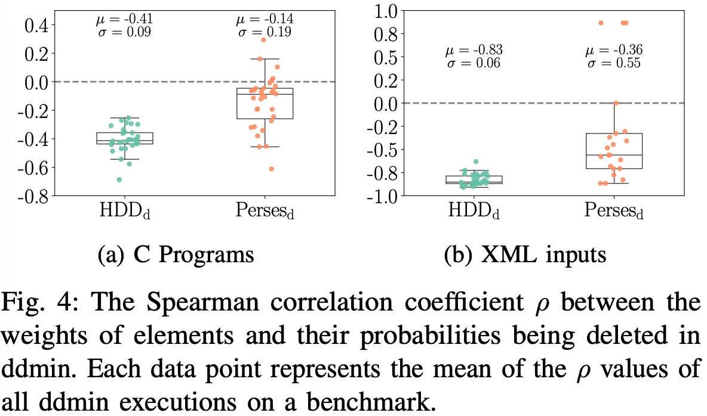

# Artifact for "WDD: Weighted Delta Debugging"

## Introduction

Thank you for evaluating this artifact.

To evaluate this artifact, a Linux machine with [docker](https://docs.docker.com/get-docker/) is needed.

## List of Claims Supported by the Artifact

- WDD introduce the concept of weight to the classical delta debugging algorithms, supporting more rational partitioning strategy during delta debugging.
- $W_{ddmin}$ and $W_{ProbDD}$, the implementations of WDD in ddmin and ProbDD, outperform ddmin and ProbDD, respectively, in both efficiecny and effectiveness in tree-based test input minimization techniques, HDD and Perses.

## Notes

- All the experiments take very long time to finish, so it is recommended to use tools like screen and tmux to manage sessions if the experiments are run on remote server.
- The experiments involving ProbDD in this paper were repeated 5 times to mitigate the randomness of ProbDD algorithms.

## Docker Environment Setup

1. If docker is not installed, install it by following the [instructions](https://docs.docker.com/get-docker/).

2. Install the docker image.

   ```shell
   docker pull [xxx]
   ```

3. Start a container

   ```shell
   docker container run --cap-add SYS_PTRACE --interactive --tty [xxx] /bin/bash
   cd /tmp/WeightDD/
   ```

## Benchmark Suites

Under the root directory of the project, the benchmarks are located in:

- `./c_benchmarks`: benchmark-C which consists of 32 C programs;
- `./xml_benchmarks`: benchmark-XML which consists of 30 XML files.

## Implementation

We implemented all the related algorithms in this paper based on [Perses](https://github.com/uw-pluverse/perses). Our implemenations locate

in `./perses-weight-dd`. Specifically:

- $W_{ddmin}$ algorithm is implemented in:

  `./perses-weight-dd/src/org/perses/delta/WeightSplitDeltaDebugger.kt`

- $W_{ProbDD}$ algorithm is implemented in:

  `./perses-weight-dd/src/org/perses/delta/WeightedPristineProbabilisticDeltaDebugger.kt`

- The baseline algorithms ddmin and ProbDD, and HDD are implemented in:

  ```shell
  ./perses-weight-dd/src/org/perses/delta/PristineDeltaDebugger.kt # ddmin
  ./perses-weight-dd/src/org/perses/delta/PristineProbabilisticDeltaDebugger.kt # ProbDD
  ./perses-weight-dd/src/org/perses/reduction/reducer/hdd/ # HDD
  ```

- The reducers (i.e. the combinations of HDD and Perses, with ddmin, $W_{ddmin}$, ProbDD, and $W_{ProbDD}$) are implemented in:

  ```shell
  ./perses-weight-dd/src/org/perses/reduction/reducer/hdd/PristineHDDReducer.kt # HDD-ddmin
  ./perses-weight-dd/src/org/perses/reduction/reducer/hdd/WeightedPristineHDDReducer.kt # HDD-Wddmin
  ./perses-weight-dd/src/org/perses/reduction/reducer/hdd/ProbHDDReducer.kt # HDD-ProbDD
  ./perses-weight-dd/src/org/perses/reduction/reducer/hdd/WeightedProbHDDReducer.kt #HDD-WProbDD
  
  ./perses-weight-dd/src/org/perses/reduction/reducer/PersesNodeDDminReducer.kt # Perses-ddmin
  ./perses-weight-dd/src/org/perses/reduction/reducer/PersesNodeWDDReducer.kt # Perses-Wddmin
  ./perses-weight-dd/src/org/perses/reduction/reducer/PersesNodeProbDDReducer.kt # Perses-ProbDD
  ./perses-weight-dd/src/org/perses/reduction/reducer/PersesNodeWeightedProbDDReducer.kt # Perses-WProbD
  ```

To run the evaluation, we need perses (including Perses, HDD, and all related algorithms in this paper). For convenience , we have pre-built the tools and put them under `/tmp/binaries/` in the docker image (also put in the `tools` directory of this repo. Three JAR files are required fo evaluation:

```
> tree /tmp/binaries/
/tmp/binaries/
|-- perses_deploy.jar
|-- perses_stat_deploy.jar
`-- token_counter_deploy.jar
```

## RQ1: Element Weight v.s. Deletion Probability Correlation

```shell
cd /tmp/WeightDD
# For XML benchmarks:
./run_stat_parallel_xml.py -s xml_benchmarks/xml-* -r perses_ddmin_stat hdd_ddmin_stat -o stat_result_xml -j 20
# For C Benchmarks:
./run_stat_parallel_c.py -s c_benchmarks/* -r perses_ddmin_stat hdd_ddmin_stat -o stat_result_c -j 20
# Export data to csv files:

```

## RQ2: $W_{ddmin}$ v.s. $ddmin$

```shell
# For C Benchmarks:
./run_exp_parallel_c.py -s c_benchmarks/* -r perses_ddmin perses_wdd hdd_ddmin hdd_wdd -o result_wdd_c -j 20
# For XML Benchmarks:
./run_exp_parallel_xml.py -s xml_benchmarks/xml-* -r perses_ddmin perses_wdd hdd_ddmin hdd_wdd -o result_wdd_xml -j 20
# Export the results in csv format:
./convert_result_to_csv.py -d result_wdd_c/hdd_ddmin_0/*  -o hdd_ddmin_c.csv
./convert_result_to_csv.py -d result_wdd_c/hdd_wdd_0/*  -o hdd_wdd_c.csv
./convert_result_to_csv.py -d result_wdd_c/perses_ddmin_0/*  -o perses_ddmin_c.csv
./convert_result_to_csv.py -d result_wdd_c/perses_wdd_0/*  -o perses_wdd_c.csv
./convert_result_to_csv.py -d result_wdd_xml/hdd_ddmin_0/*  -o hdd_ddmin_xml.csv
./convert_result_to_csv.py -d result_wdd_xml/hdd_wdd_0/*  -o hdd_wdd_xml.csv
./convert_result_to_csv.py -d result_wdd_xml/perses_ddmin_0/*  -o perses_ddmin_xml.csv
./convert_result_to_csv.py -d result_wdd_xml/perses_wdd_0/*  -o perses_wdd_xml.csv
```

## RQ3: $W_{ProbDD}$ v.s. $ProbDD$

```shell
# For C Benchmarks:
./run_exp_parallel_c.py -s c_benchmarks/* -r perses_probdd perses_wprobdd hdd_probdd hdd_wprobdd -o result_wprobdd_c -j 20
# For XML Benchmarks:
./run_exp_parallel_xml.py -s xml_benchmarks/xml-* -r perses_probdd perses_wprobdd hdd_probdd hdd_wprobdd -o result_wprobdd_xml -j 20
# Export the results in csv format:
./convert_result_to_csv.py -d result_wprobdd_c/hdd_probdd_0/*  -o hdd_probdd_c.csv
./convert_result_to_csv.py -d result_wprobdd_c/hdd_wprobdd_0/*  -o hdd_wprobdd_c.csv
./convert_result_to_csv.py -d result_wprobdd_c/perses_probdd_0/* -o perses_probdd_c.csv
./convert_result_to_csv.py -d result_wprobdd_c/perses_wprobdd_0/* -o perses_wprobdd_c.csv
./convert_result_to_csv.py -d result_wprobdd_xml/hdd_probdd_0/*  -o hdd_probdd_xml.csv
./convert_result_to_csv.py -d result_wprobdd_xml/hdd_wprobdd_0/*  -o hdd_wprobdd_xml.csv
./convert_result_to_csv.py -d result_wprobdd_xml/perses_probdd_0/* -o perses_probdd_xml.csv
./convert_result_to_csv.py -d result_wprobdd_xml/perses_wprobdd_0/* -o perses_wprobdd_xml.csv
```

## Evaluation Results

**RQ1**: The raw data of the weights information during delta debugging are put in `results_rq1`, and the correlation values are exported to the csv files under `results_rq1_csv`. Using box diagram to visualize the result:



From this figure, the probability of elements being deleted is negatively correlated with their weights in ddmin executions in both HDD and Perses, to varying degrees. This validation provides a solid foundation for the design of $W_{ddmin}$.

**RQ2 &RQ3**:  The raw data of the evaluation results used in RQ2 & 3 are posted in `results_c` and `results_xml` directories, and the exported csv files using `convert_result_to_csv.py`  are put under `results_csv`. The following tables provides a brief illustration of the overall (average) results of each algorithm.

RQ2: $W_{ddmin}$ v.s. ddmin

| Benchmark      | HDD-ddmin |      | HDD-Wddmin             |                        | Perses-ddmin |      | Perses-Wddmin         |                       |
| -------------- | --------- | ---- | ---------------------- | ---------------------- | ------------ | ---- | --------------------- | --------------------- |
|                | Time (s)  | Size | Time (s)               | Size                   | Time (s)     | Size | Time (s)              | Size                  |
| **C Programs** | 39,108    | 518  | 18,022                 | 477                    | 4,582        | 281  | 4,169                 | 278                   |
|                |           |      | **53.92%$\downarrow$** | **7.81%$\downarrow$**  |              |      | **9.01%$\downarrow$** | **1.04%$\downarrow$** |
| **XML Files**  | 3,152     | 98   | 2,621                  | 82                     | 1,295        | 37.6 | 1,273                 | 37.5                  |
|                |           |      | **16.86%$\downarrow$** | **16.51%$\downarrow$** |              |      | **1.67%$\downarrow$** | **0.27%$\downarrow$** |

RQ3: $W_{ProbDD}$ v.s. ProbDD

| Benchmark      | HDD-ProbDD |      | HDD-WProbDD            |                        | Perses-ProbDD |      | Perses-WProbDD         |                       |
| -------------- | ---------- | ---- | ---------------------- | ---------------------- | ------------- | ---- | ---------------------- | --------------------- |
|                | Time (s)   | Size | Time (s)               | Size                   | Time (s)      | Size | Time (s)               | Size                  |
| **C Programs** | 6,042      | 567  | 5,384                  | 488                    | 3,455         | 280  | 2,975                  | 273                   |
|                |            |      | **10.89%$\downarrow$** | **13.91%$\downarrow$** |               |      | **13.89%$\downarrow$** | **2.43%$\downarrow$** |
| **XML Files**  | 3,004      | 89   | 2,574                  | 80                     | 1,838         | 37.4 | 1,813                  | 37.5                  |
|                |            |      | **14.31%$\downarrow$** | **9.74%$\downarrow$**  |               |      | **1.35%$\downarrow$**  | **0.42%$\uparrow$**   |


